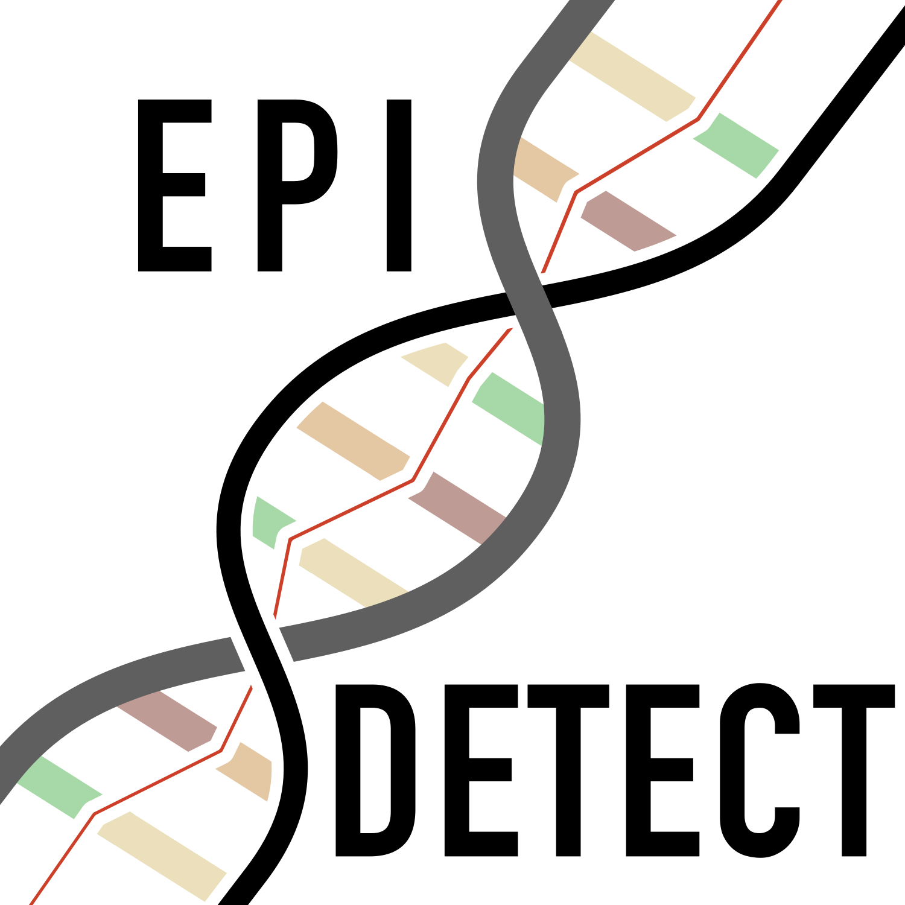

<p align="center">
  
</p>

 

# A Novel Explainable Deep-Learning Approach For Network Analysis of Epistatic Interaction
Detection of SNP-SNP epistasis via neural network models interpretation. This is the official repository of the work "A Novel Deep-Learning Approach For Network Analysis of Epistatic Interactions".

This repository contains the implementation of the EpiCID algorithm for explainability and of the centrality analysis framework of EpiDetect.

The reposotory provides the code for both training and explaianiling the NN models using the provided XAI method. The data are not contained in the repo since not freely available.

### Model defintion and training (optional)

The repo contains the scrit ```regressionNetDense.py``` that can be used to train a MLP model. The file can be edited to adpat it to your own data. In order to reproduce the results in the paper, it is enough to skip this step and perform the subsequent explanation phase using the neural network weights provided in the repository. Those are the weight learned by the NN model trained on the UK Biobank dataset (as described in the paper).

### Model explainability

By running the script ```epistaticCosineInteractionDetectionSNPAggregationMutliWay.py``` it is possbile to explain the model and determine interacting input features (SNPs). The script will load the NN weights and apply the EpiCID algorithm, generating a file with interacting pairs of SNPs. In the repo you will find pre-computed weights, obtained from the models we used in the paper.

### Centrality analysis

Using the script ```AutoScape.py``` it is possible run centrality analysis on epistatic network obtained with the previous step. In the paper it was run on the top-1000 interactions. The script ```CentralGenesAnalyzer.py``` preforms analysis and statistics on the central genes.

### Enrichment analysis
After having obtained the central genes, use [Enrichr](https://maayanlab.cloud/Enrichr/) to perform enrichment analysis.

#### Credits

Special thanks to [Simone Fiacco](https://www.linkedin.com/in/simone-fiacco-27bb5a25a/) for creating the EpiDetect logo.

